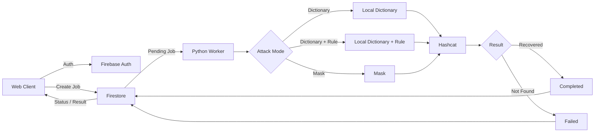
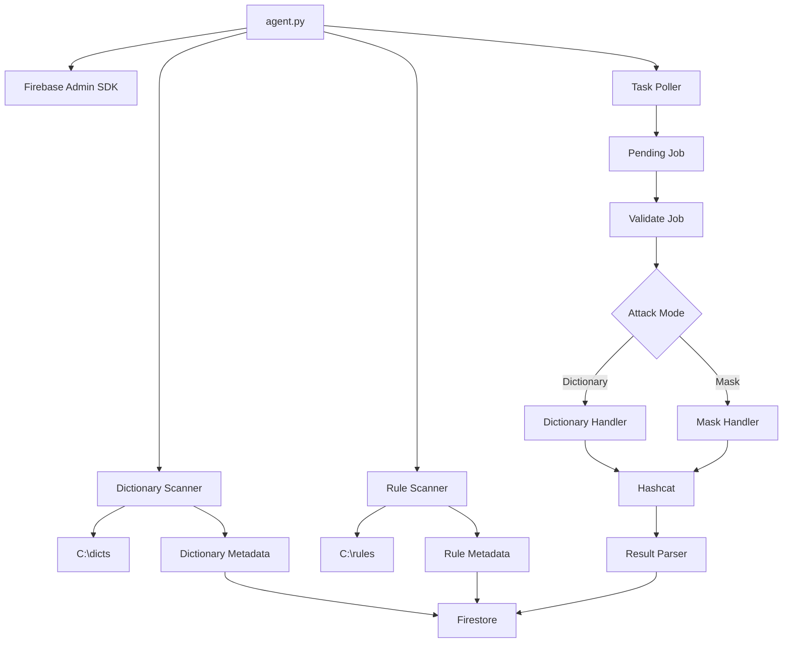
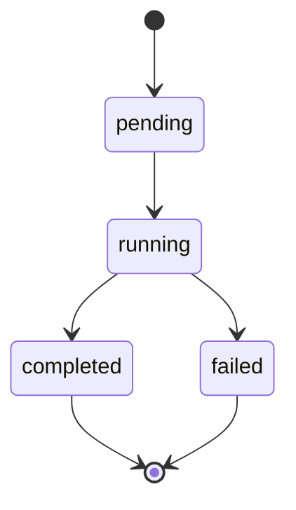
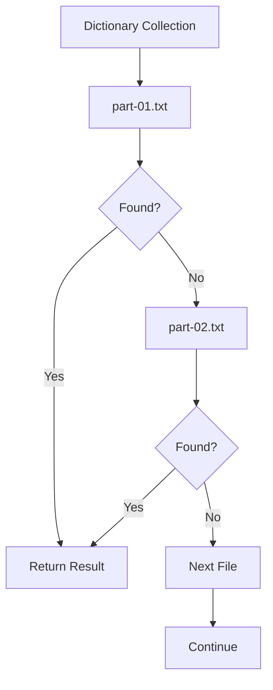
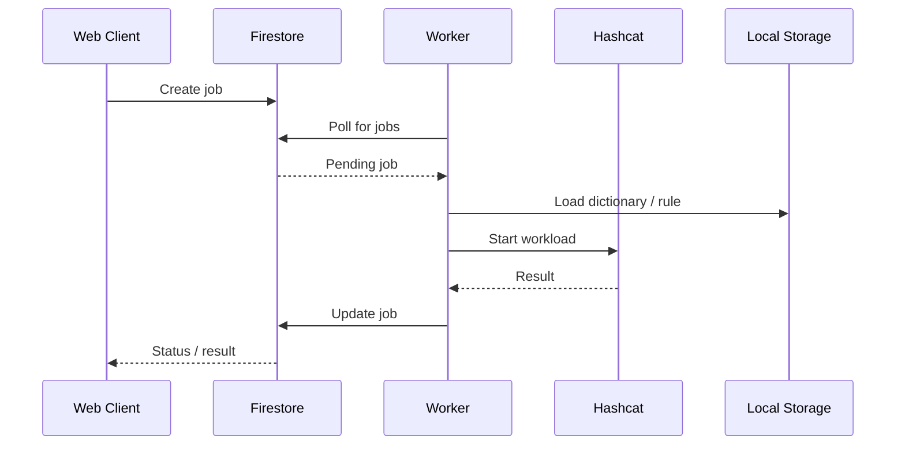

# Brute

**Remote password-recovery orchestration platform**

Brute is a web-controlled system for running password-recovery workloads on a local GPU worker.

The web application is used to create and monitor jobs. A Python worker running on a Windows machine pulls pending jobs from Firestore and executes them with Hashcat.

Dictionaries and Hashcat rules stay on the worker instead of being uploaded to the web application.

> **Authorized use only.** Use Brute only for systems, credentials, CTFs, or research environments where you have explicit permission to perform password recovery.

---

## Architecture



### Components

| Component       | Technology      | Role                                        |
| --------------- | --------------- | ------------------------------------------- |
| Web Client      | Web application | Authentication, job creation and monitoring |
| Authentication  | Firebase Auth   | User authentication                         |
| Backend         | Firestore       | Job queue, metadata and state               |
| Worker          | Python          | Job processing and Hashcat orchestration    |
| Recovery Engine | Hashcat         | GPU-accelerated password recovery           |
| Dictionaries    | Local storage   | Wordlists used by the worker                |
| Rules           | Local storage   | Hashcat rule files                          |

The important part of the design is that **the control plane and compute workload are separated**.

The web application handles jobs. The worker handles the actual workload.

---

## Worker

The worker is implemented in `agent.py`.

At startup it:

1. Initializes Firebase.
2. Scans the local dictionary and rule directories.
3. Publishes available metadata to Firestore.
4. Waits for pending jobs.
5. Validates the job configuration.
6. Selects the requested attack mode.
7. Runs Hashcat.
8. Writes the result back to Firestore.



---

## Supported Attack Modes

| Mode              | Description                                    | Status      |
| ----------------- | ---------------------------------------------- | ----------- |
| Dictionary        | Run a local dictionary against a supplied hash | Implemented |
| Dictionary + Rule | Apply a local Hashcat rule to a dictionary     | Implemented |
| Mask              | Run a Hashcat mask attack                      | Implemented |

The worker selects the appropriate handler using the job's `attack_mode` field.

---

## Job Lifecycle



### `pending`

The job has been created and is waiting for a worker.

### `running`

The worker has picked up the job and started processing it.

### `completed`

A recovery result was found.

### `failed`

The workload finished without a result, or the job configuration was invalid.

---

## Local Storage

The worker expects dictionaries and rules to be stored locally.

Default directories:

```text
C:\dicts
C:\rules
```

A possible worker layout:

```text
C:\
├── hashcat\
│   └── hashcat.exe
│
├── dicts\
│   ├── common\
│   │   ├── part-01.txt
│   │   ├── part-02.txt
│   │   └── part-03.txt
│   │
│   └── custom\
│       └── passwords.txt
│
├── rules\
│   ├── best64.rule
│   └── custom.rule
│
└── brute\
    ├── agent.py
    ├── requirements.txt
    └── .env
```

Directories can contain multiple dictionary files. When a collection is selected, the worker processes the files sequentially.



Only dictionary and rule **metadata** is synchronized with Firestore. The actual files remain on the worker.

---

## Metadata Synchronization

The worker periodically scans:

```text
C:\dicts
C:\rules
```

and publishes information about the available files to:

```text
metadata/dictionary_rules
```

The web client can then display the available dictionaries and rules without receiving their contents.

The current refresh interval is **1 hour**.

---

## Hash Handling

The current worker includes basic automatic hash-mode detection.

Supported modes:

```text
22000
2500
```

If the detection logic does not identify a supported format, the worker currently falls back to `22000`.

Hash detection is intentionally limited to the formats currently implemented by the project.

---

## Hashcat

Dictionary attacks use:

```text
-a 0
-w 3
--outfile-format 2
--potfile-disable
```

Mask attacks use:

```text
-a 3
```

The worker creates temporary input/output files for the workload, waits for Hashcat to finish, parses the result and removes the temporary files.

---

## Configuration

The worker currently uses local paths for its dependencies.

Example:

```python
HASHCAT_PATH = r"C:\hashcat\hashcat.exe"
CRED_PATH = r"C:\brute\credentials.json"
PROJECT_ID = "brute-me"

DICT_BASE = r"C:\dicts"
RULE_BASE = r"C:\rules"

POLL_INTERVAL = 30
METADATA_UPDATE_INTERVAL = 3600
```

Machine-specific values should not be hardcoded when deploying the worker.

A local `.env` or configuration file can be used instead.

---

## Requirements

### Software

* Windows
* Python 3
* Hashcat
* Firebase project
* Firestore
* Firebase Admin SDK credentials

### Hardware

A compatible GPU is recommended for Hashcat workloads.

Storage requirements depend mainly on the size of the dictionaries and rule sets stored on the worker.

---

## Installation

### 1. Clone the repository

```powershell
git clone https://github.com/reyphia/brute.git
cd brute
```

### 2. Create a virtual environment

```powershell
python -m venv .venv
.venv\Scripts\Activate.ps1
```

### 4. Install Hashcat

Install Hashcat on the worker machine.

The example configuration expects:

```text
C:\hashcat\hashcat.exe
```

### 5. Create local directories

```powershell
mkdir C:\dicts
mkdir C:\rules
```

Place authorized dictionaries in:

```text
C:\dicts
```

and Hashcat rule files in:

```text
C:\rules
```

### 6. Configure Firebase

Set up the Firebase Admin SDK credentials locally.

### 7. Start the worker

```powershell
python agent.py
```

The worker will initialize Firebase, scan the local storage, publish metadata and start polling for pending jobs.

---

## Job Format

### Dictionary job

```json
{
  "status": "pending",
  "hash": "<hash>",
  "attack_mode": "dict",
  "dict": "<dictionary-name>",
  "rule": "<rule-name>"
}
```

### Mask job

```json
{
  "status": "pending",
  "hash": "<hash>",
  "attack_mode": "mask",
  "mask": "<mask-pattern>"
}
```

The job schema may change as the web application evolves.

---

## Results

A successful recovery is stored as:

```json
{
  "status": "completed",
  "result": "<recovered-value>",
  "progress": 100
}
```

If no result is found:

```json
{
  "status": "failed",
  "error": "Password not found",
  "progress": 100
}
```

The worker also records a completion timestamp.

---

## Task Flow



The large local datasets and machine-specific files are intentionally kept outside the repository:

```text
C:\
├── hashcat\
├── dicts\
├── rules\
└── brute\
```

---

## Limitations

Current limitations:

* Hash detection supports only the implemented formats.
* Progress is currently reported at job completion rather than as live Hashcat telemetry.
* The worker architecture currently assumes a single worker.
* Machine-specific configuration still relies on local paths.
* There is no job cancellation or pause/resume support yet.
* Worker authentication can be strengthened further.

---

## License

MIT License

See [`LICENSE`](LICENSE) for the full license text.
