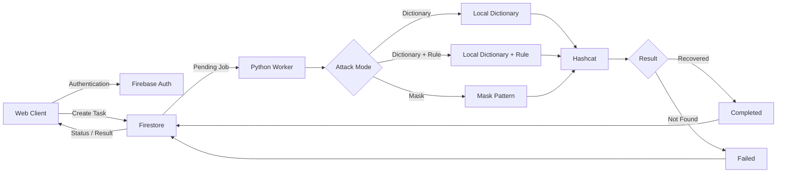
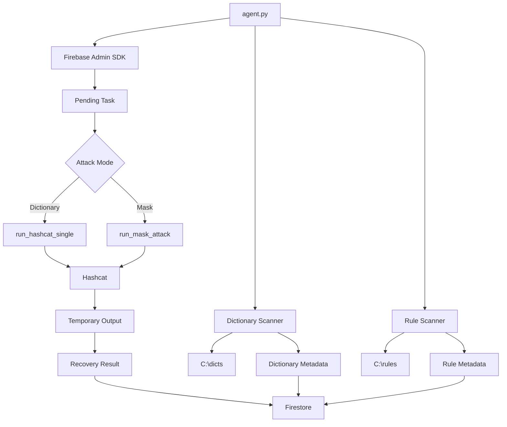
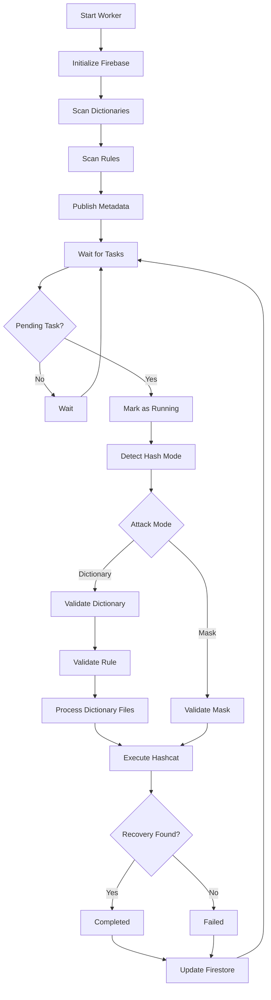
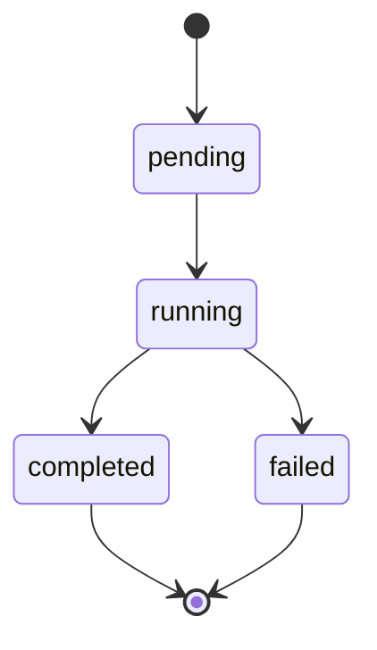
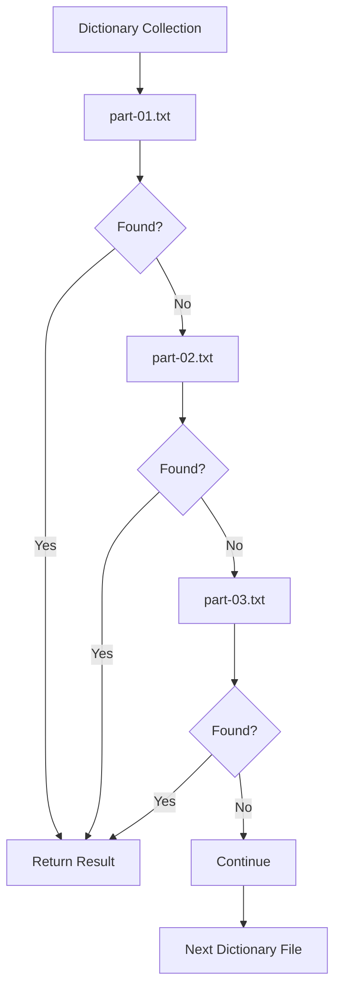
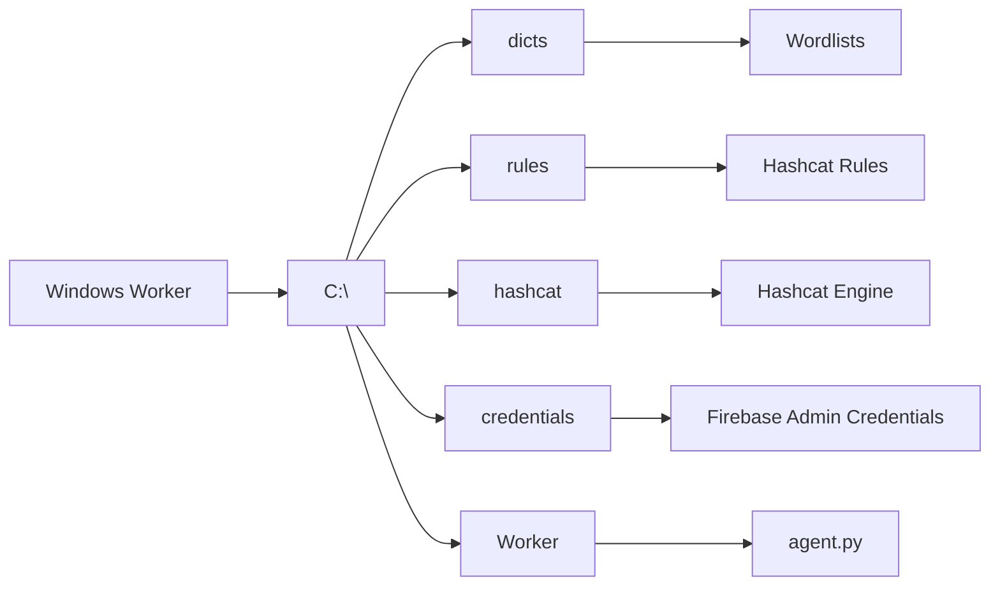
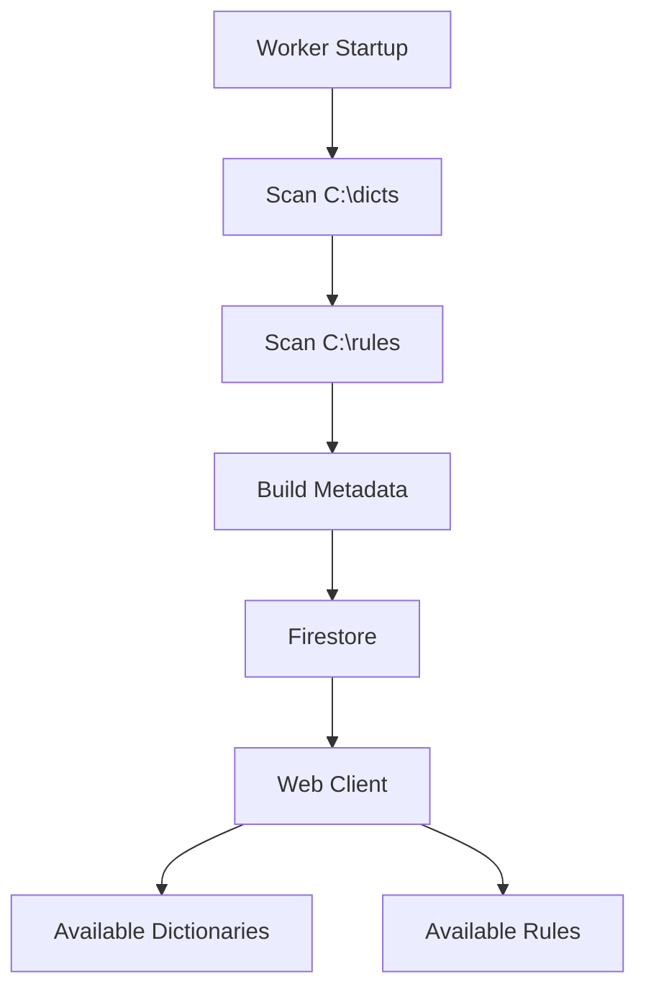
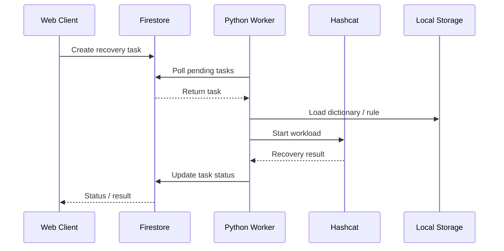
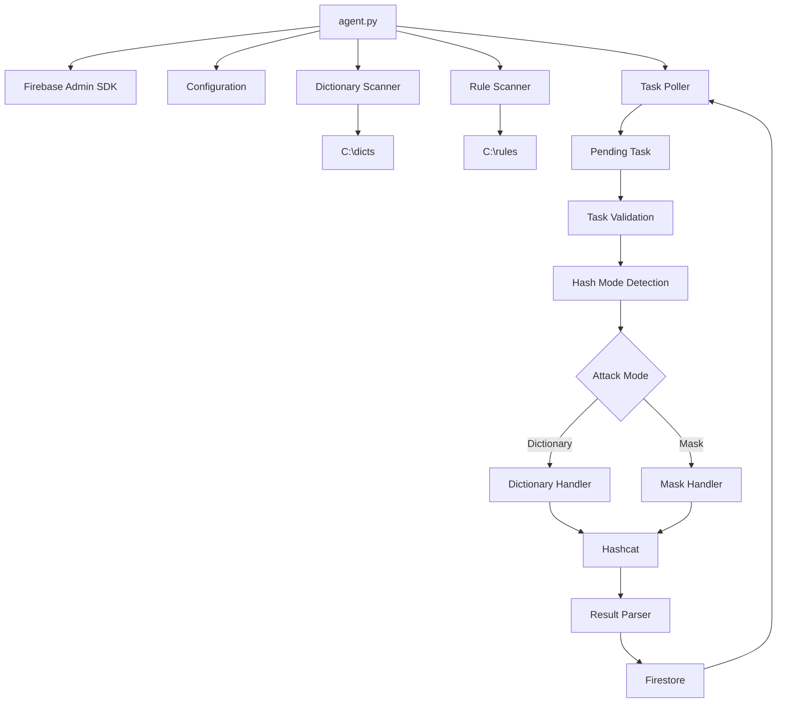

# Brute

**Remote Password-Recovery Orchestration Platform**

Brute is a web-controlled password-recovery system for authorized security testing, password recovery, CTFs, and isolated research environments.

The system separates the **remote control plane** from the **local GPU workload**: tasks are created through a web interface, stored in Firestore, and executed by a Python worker on a dedicated Windows machine running Hashcat.

Large dictionaries and rule sets remain on the local worker and are never required to be uploaded through the web interface.

---

## Architecture



---

## System Components

| Component       | Technology      | Purpose                                           |
| --------------- | --------------- | ------------------------------------------------- |
| Web Client      | Web application | Authentication, task configuration and monitoring |
| Authentication  | Firebase Auth   | User authentication                               |
| Task Backend    | Firestore       | Task queue, metadata and job state                |
| Worker          | Python          | Task orchestration and Hashcat execution          |
| Recovery Engine | Hashcat         | Local GPU workload                                |
| Dictionaries    | Local HDD       | Wordlist storage                                  |
| Rules           | Local HDD       | Hashcat rule storage                              |

---

## Worker Architecture

The local worker is implemented in `agent.py`.



---

## Worker Lifecycle



---

## Task Lifecycle



### `pending`

A task has been created and is waiting for the worker.

### `running`

The worker has accepted the task and started processing it.

### `completed`

A recovery result was found.

### `failed`

The workload completed without finding a result, or the task configuration was invalid.

---

## Attack Modes

| Mode              | Description                                          | Status        |
| ----------------- | ---------------------------------------------------- | ------------- |
| Dictionary        | Process a local dictionary against the supplied hash | ✅ Implemented |
| Dictionary + Rule | Apply a local Hashcat rule to a dictionary           | ✅ Implemented |
| Mask              | Execute a Hashcat mask attack                        | ✅ Implemented |

The worker selects the workflow using the task's `attack_mode` field.

---

## Dictionary Architecture

Dictionaries are stored locally on the worker machine.

The worker automatically scans:

```text
C:\dicts
```

A dictionary can be a single file:

```text
C:\
└── dicts\
    └── passwords.txt
```

or a collection of files:

```text
C:\
└── dicts\
    └── large-dictionary\
        ├── part-01.txt
        ├── part-02.txt
        ├── part-03.txt
        └── part-04.txt
```

When a directory is selected, the worker processes its files sequentially.



This allows large wordlists to be split into multiple files while keeping them entirely on the worker machine.

---

## Rule Architecture

Rules are stored locally under:

```text
C:\rules
```

Example:

```text
C:\
└── rules\
    ├── best64.rule
    ├── custom.rule
    └── ...
```

The worker automatically discovers files ending in:

```text
.rule
```

Available rules are published as metadata to Firestore.

A `none` option is also available when no rule should be applied.

---

## Local Storage Architecture



Recommended layout:

```text
C:\
├── hashcat\
│   └── hashcat.exe
│
├── dicts\
│   ├── common\
│   │   ├── part-01.txt
│   │   ├── part-02.txt
│   │   └── part-03.txt
│   │
│   ├── custom\
│   │   └── passwords.txt
│   │
│   └── ...
│
├── rules\
│   ├── best64.rule
│   ├── custom.rule
│   └── ...
│
└── brute\
    ├── agent.py
    ├── requirements.txt
    └── .env
```

---

## Hash Handling

The current implementation performs basic automatic hash-mode detection.

Currently implemented modes:

```text
22000
2500
```

If the implemented detection logic does not identify another format, the worker currently falls back to `22000`.

Hash-mode detection is intentionally simple in the current version and can be expanded later.

---

## Hashcat Execution

Dictionary workloads use Hashcat with:

```text
-a 0
-w 3
--outfile-format 2
--potfile-disable
```

Mask workloads use:

```text
-a 3
```

The worker creates temporary hash and output files, waits for Hashcat to finish, reads the result and removes the temporary files.

---

## Metadata Synchronization

The worker periodically scans:

```text
C:\dicts
C:\rules
```

and publishes their metadata to:

```text
metadata/dictionary_rules
```

The actual dictionary and rule contents remain local.



The current metadata refresh interval is **1 hour**.

---

## Configuration

The worker uses local paths for its dependencies.

Example configuration:

```python
HASHCAT_PATH = r"C:\hashcat\hashcat.exe"
CRED_PATH = r"C:\brute\credentials.json"
PROJECT_ID = "brute-me"

DICT_BASE = r"C:\dicts"
RULE_BASE = r"C:\rules"

POLL_INTERVAL = 30
METADATA_UPDATE_INTERVAL = 3600
```

Machine-specific configuration should eventually be moved to environment variables or an external configuration file.

---

## Requirements

### Software

* Windows
* Python 3
* Hashcat
* Firebase project
* Firestore
* Firebase Admin SDK credentials

### Hardware

A compatible GPU is recommended for the intended Hashcat workloads.

Required storage depends on the size of the locally maintained dictionaries and rule sets.

---

## Installation

### Clone

```powershell
git clone <repository-url>
cd brute
```

### Virtual Environment

```powershell
python -m venv .venv
.venv\Scripts\Activate.ps1
```

### Install Dependencies

```powershell
pip install -r requirements.txt
```

### Hashcat

Install Hashcat locally.

Example:

```text
C:\hashcat\hashcat.exe
```

### Create Local Storage

```powershell
mkdir C:\dicts
mkdir C:\rules
```

Place authorized dictionaries under:

```text
C:\dicts
```

and Hashcat rule files under:

```text
C:\rules
```

### Firebase

Configure the Firebase Admin SDK credentials locally.

### Start Worker

```powershell
python agent.py
```

The worker initializes Firebase, discovers available dictionaries and rules, publishes metadata and begins polling for pending tasks.

---

## Task Flow



---

## Task Structure

Dictionary task:

```json
{
  "status": "pending",
  "hash": "<hash>",
  "attack_mode": "dict",
  "dict": "<dictionary-name>",
  "rule": "<rule-name>"
}
```

Mask task:

```json
{
  "status": "pending",
  "hash": "<hash>",
  "attack_mode": "mask",
  "mask": "<mask-pattern>"
}
```

The schema may evolve as the web application develops.

---

## Result Handling

Successful recovery:

```json
{
  "status": "completed",
  "result": "<recovered-value>",
  "progress": 100
}
```

Unsuccessful recovery:

```json
{
  "status": "failed",
  "error": "Password not found",
  "progress": 100
}
```

The worker also records a completion timestamp.

---

## Project Structure

```text
brute/
├── agent.py
├── README.md
├── LICENSE
├── requirements.txt
├── .gitignore
└── .env.example
```

The local worker environment is separate:

```text
C:\
├── hashcat\
├── dicts\
├── rules\
└── brute\
```

This separation keeps large local datasets and machine-specific dependencies outside the Git repository.

---

## Security & Privacy

Brute is designed for:

* Authorized password recovery
* Personal security laboratories
* CTF environments
* Controlled security research
* Systems owned or explicitly authorized for testing

Only use the system where password recovery or security testing is authorized.

### Never commit

```text
Firebase service-account credentials
.env
Private keys
API tokens
Passwords
Real recovered credentials
Private dictionaries
Real production hashes
```

Large dictionaries should remain on the local worker rather than being stored in GitHub.

If a Firebase service-account key has ever been exposed publicly, it should be revoked and replaced.

---

## Current Implementation

| Feature                       | Status |
| ----------------------------- | ------ |
| Firebase task queue           | ✅      |
| Python worker                 | ✅      |
| Dictionary discovery          | ✅      |
| Rule discovery                | ✅      |
| Dictionary attack             | ✅      |
| Dictionary + Rule attack      | ✅      |
| Mask attack                   | ✅      |
| Multiple dictionary files     | ✅      |
| Automatic metadata publishing | ✅      |
| Temporary file cleanup        | ✅      |
| Real-time Hashcat progress    | 🚧     |
| ETA calculation               | 🚧     |
| Job cancellation              | 🚧     |
| Pause / Resume                | 🚧     |
| Worker heartbeat              | 🚧     |
| GPU telemetry                 | 🚧     |
| Multiple workers              | 🚧     |
| WebSocket live updates        | 🚧     |

---

## Current Limitations

### Progress Reporting

The current worker does not yet expose real-time Hashcat telemetry.

At the moment, task progress is initialized and updated to `100` after the workload finishes.

Future versions can expose:

* Current progress
* Hashrate
* ETA
* Candidates tested
* GPU utilization

### Worker Management

The current architecture is primarily designed around a single worker.

Multiple workers can be introduced later through worker identification, leases and task ownership.

### Configuration

Machine-specific paths are currently represented as local configuration values and should eventually be moved into environment variables.

### Hash Detection

Automatic hash-mode detection currently covers only the formats implemented by the worker.

---

## Roadmap

```text
[x] Firebase task queue
[x] Local Python worker
[x] Dictionary discovery
[x] Rule discovery
[x] Dictionary attacks
[x] Rule-based dictionary attacks
[x] Mask attacks
[x] Task result reporting
[x] Temporary file cleanup

[ ] Real-time Hashcat progress
[ ] Speed / ETA reporting
[ ] Job cancellation
[ ] Pause / resume
[ ] Worker heartbeat
[ ] GPU telemetry
[ ] Worker online/offline status
[ ] Multiple GPU workers
[ ] Job history
[ ] Improved hash-mode detection
[ ] External configuration
[ ] Stronger worker authentication
[ ] WebSocket live updates
```

---

## Development Architecture



---

## Design Principles

### Remote Control, Local Compute

The web interface is responsible for task management.

The worker is responsible for the actual compute workload.

```text
Web
 │
 ▼
Firestore
 │
 ▼
Worker
 │
 ├── Local dictionaries
 ├── Local rules
 └── Hashcat / GPU
```

This avoids transferring large dictionaries through the web application.

### Local Data Ownership

The worker keeps dictionaries and rules on the local machine.

Only metadata required by the web interface is synchronized.

### Stateless Task Execution

Each task contains the information required for the worker to select an attack workflow and execute it.

Temporary files are created only for the duration of the workload and removed afterwards.

---

## License

MIT License

See [`LICENSE`](LICENSE) for the complete license text.
