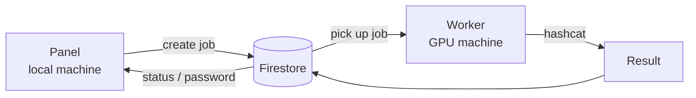

# Brute

Brute is a remote password-recovery orchestration system (WPA2 / hashcat)
controlled from a web panel.

> **Authorized use only.** Only use Brute against networks and hashes you
> have explicit permission to test (your own network, a lab, a CTF, a
> contracted pentest). Cracking someone else's Wi-Fi password without the
> owner's permission is illegal.

## What the project is made of

The web part and the Python agent used to live mixed together in one
folder, which made it unclear what actually needed to be installed and
where. They're now two separate, independent components:

```
brute/
├── panel/     ← web panel. Installed once on your "local" machine
│               (laptop/desktop) — this is where you create jobs and watch
│               progress.
└── worker/    ← Python agent. Installed on the GPU machine ("worker") that
                actually runs the cracking via hashcat. Dictionaries and
                rules live only there.
```

The two components only talk to each other through Firestore (Firebase's
database) — the panel writes a job there, the worker picks it up, runs it
and writes the result back. There's no direct panel <-> worker connection,
so they can live on different machines on different networks.



## Quick start

### 1. Firebase (once, shared by panel and worker)

1. Create a project at [console.firebase.google.com](https://console.firebase.google.com).
2. Enable **Authentication -> Email/Password** and create yourself a user (the login/password used to sign into the panel).
3. Enable **Firestore Database**.
4. Project settings -> General -> Your apps -> add a Web app — you'll take the keys for `panel/.env` from here.
5. Project settings -> Service accounts -> Generate new private key — the downloaded `.json` is what `worker/config.json` needs.

### 2. Panel (local machine)

```
cd panel
copy .env.example .env      # fill in with the keys from step 1.4
npm install
npm start                   # http://localhost:3000 — panel in your browser
```

Or, if you'd rather have a standalone `.exe` instead of a browser tab —
see "Building the .exe files" below.

### 3. Worker (GPU machine)

1. Install [hashcat](https://hashcat.net/hashcat/) on the GPU machine.
2. Install Python 3.10+.
3. ```
   cd worker
   pip install -r requirements.txt
   python agent.py
   ```
4. On first run, a `config.json` file is created next to it — fill it in (see the example in `config.example.json`):
   - `hashcat_path` — path to `hashcat.exe`;
   - `credentials_path` — path to the Firebase service-account JSON key (step 1.5);
   - `dict_dir` / `rule_dir` — dictionary and rule folders on this machine.
5. Run `python agent.py` again — the agent will connect to Firestore and start waiting for jobs.

Dictionaries and rules **never leave this machine** — only their names
(metadata) are synced, so the panel can show a list to pick from.

## Building the .exe files

Since the project is two independent components, there are two exe files
too — one per machine. They're built **on Windows** (this is a PyInstaller
limitation — a real, working `.exe` can only be produced on Windows itself;
cross-building from Linux/Mac does not produce a working file).

| File | Built from | Goes on |
|---|---|---|
| `panel/dist/BrutePanel.exe` | `panel/build_exe.bat` | the local machine |
| `worker/dist/BruteWorker.exe` | `worker/build_exe.bat` | the GPU machine (worker) |

On a Windows machine with Node.js and Python installed:

```
cd panel
copy .env.example .env   REM fill it in before building
build_exe.bat            REM -> panel\dist\BrutePanel.exe

cd ..\worker
build_exe.bat            REM -> worker\dist\BruteWorker.exe
```

`BrutePanel.exe` opens the panel in a normal application window (no
browser) — it's the same web UI, just packaged with a local server + window
(pywebview), with no outside connections besides Firebase.

`BruteWorker.exe` is `agent.py` packaged into a single exe. On a new
machine, the first run creates a `config.json` next to it, which you fill
in once (paths to hashcat, the Firebase key, dictionaries and rules) —
after that it's just double-click and it runs in the background, polling
the job queue.

If you run your built `.exe` on **another** computer, just copy the exe
itself and a filled-in `config.json` next to it — there's no longer
anything hardcoded in the code.

## Job format in Firestore

```json
// dictionary attack
{
  "status": "pending",
  "hash": "<contents of .hc22000>",
  "attack_mode": "dict",
  "dict": "<dictionary name>",
  "rule": "<rule name | none>"
}

// mask attack
{
  "status": "pending",
  "hash": "<contents of .hc22000>",
  "attack_mode": "mask",
  "mask": "<mask, e.g. ?u?l?l?l?d?d?d?d>"
}
```

Job statuses: `pending -> running -> completed | failed | cancelled`.
The "Cancel" button in the panel sets the job to `cancelling`; the worker
checks for this status while hashcat is running and stops the attack.

## Supported attack modes

| Mode | Hashcat | Status |
|---|---|---|
| Dictionary | `-a 0` | implemented |
| Dictionary + Rule | `-a 0 -r <rule>` | implemented |
| Mask | `-a 3` | implemented |

Hash-mode detection is currently limited to `22000`
(WPA-PBKDF2-PMKID+EAPOL) and `2500` (WPA-EAPOL-PBKDF2); if the format
can't be determined, `22000` is used.

## Known limitations

- Progress is only reported once a job finishes, not live as hashcat runs.
- Designed for a single worker at a time (multiple workers don't coordinate with each other).
- Hash-mode detection is limited to the `22000`/`2500` formats.

## License

MIT, see [`LICENSE`](./LICENSE).
